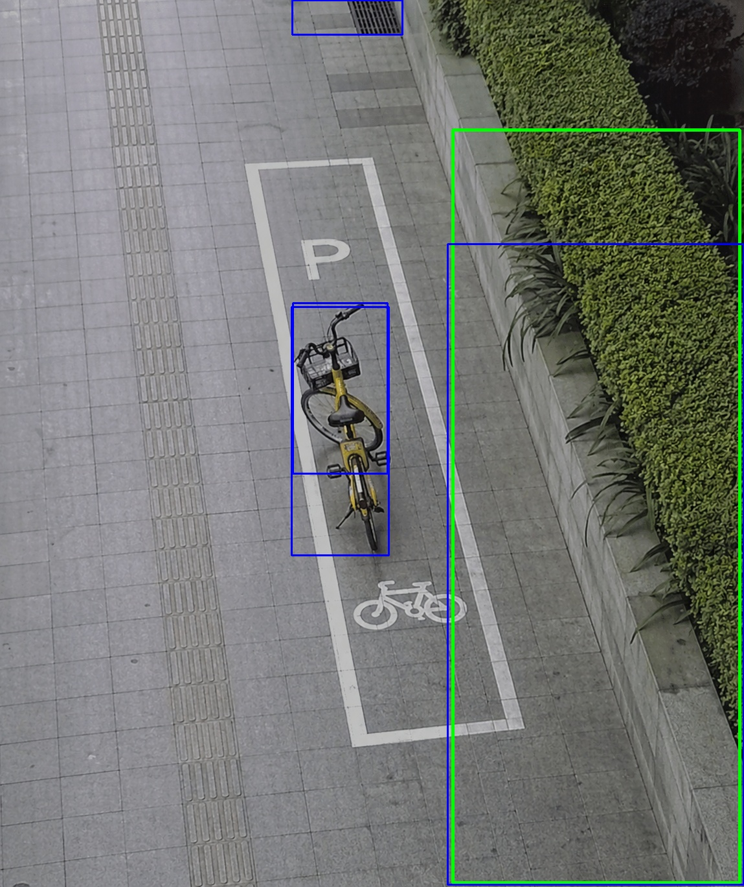

# Shared Bike Parking Detection with YOLOv8

A YOLOv8 + PyQt5 desktop application for detecting shared-bike parking violations, including fallen bikes and bikes outside designated parking areas.

## Features

- Detects `bike`, `fallen_bike`, and `parking_area`
- Uses overlap ratio logic to judge whether a bike is parked correctly
- Supports image, video, and camera input
- Stores violation records in SQLite
- Includes helper scripts for dataset preparation, sampling, label repair, and training

## Project Structure

```text
shared-bike-parking-detection-yolov8/
|-- README.md
|-- requirements.txt
|-- main.py
|-- src/
|-- ui/
|-- screenshots/
|-- docs/
`-- .gitignore
```

## Quick Start

1. Install dependencies:

```bash
pip install -r requirements.txt
```

2. Prepare a trained model locally.

By default, the app looks for:

```text
weights/best.pt
```

You can also provide a custom model path:

```powershell
$env:MODEL_PATH="D:\models\best.pt"
python main.py
```

3. Run the application:

```bash
python main.py
```

## Detection Logic

1. If a `fallen_bike` is detected, the system reports a fallen-bike violation.
2. If a `bike` and a `parking_area` are detected, the system calculates:

```text
overlap_ratio = intersection_area / bike_area
```

3. A bike is considered correctly parked when `overlap_ratio >= 0.80`.

## Screenshot



## Repository Notes

This repository intentionally excludes:

- trained weights and exported models
- training runs
- datasets and raw street-view media
- local SQLite databases
- virtual environments and Python caches

See [docs/dataset.md](docs/dataset.md) for the expected dataset layout and [docs/project-layout.md](docs/project-layout.md) for how the original working directory was reduced into this public repository.
